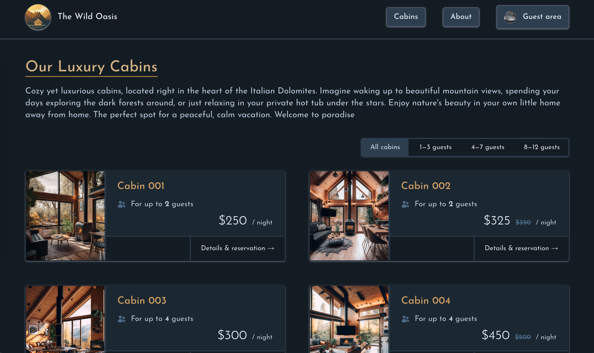
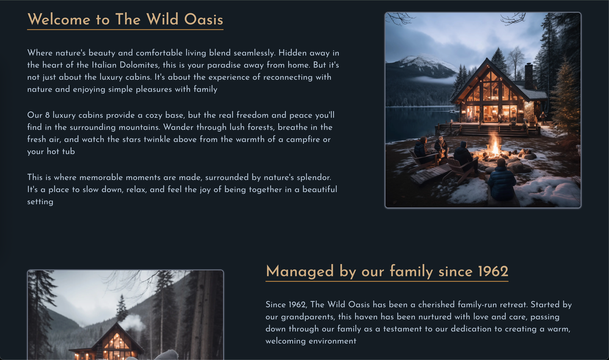
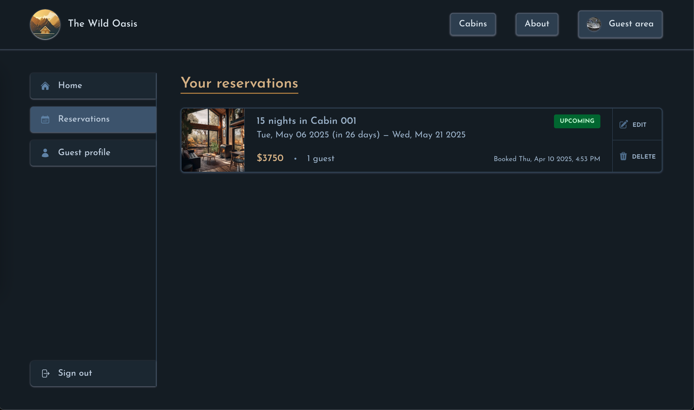
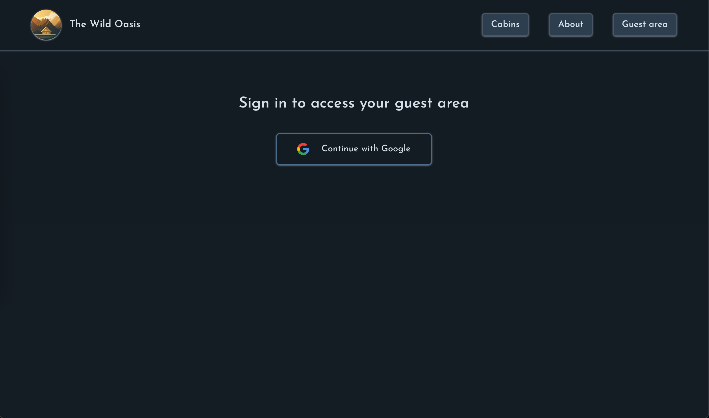

<div align="center">
  


</div>

## 𝗧𝗵𝗶𝘀 𝗽𝗿𝝾ᒍ𝗲𝗰𝘁 𝗶𝘀 𝗯𝗮𝘀𝗲𝗱 𝝾𝗻 ᒍ𝝾𝗻𝗮𝘀 𝗦𝗰𝗵𝗺𝗲𝗱𝘁𝗺𝗮𝗻𝗻'𝘀 [𝗧𝗵𝗲 𝗨𝝞𝘁𝗶𝗺𝗮𝘁𝗲 𝗥𝗲𝗮𝗰𝘁](https://www.udemy.com/user/jonasschmedtmann/) 𝗰𝝾𝞄𝗿𝘀𝗲. 𝝪𝝾𝞄 𝘀𝗵𝝾𝞄𝗹𝗱 𝗰𝗵𝗲𝗰𝗸 𝗵𝗶𝘀 𝗰𝝾𝞄𝗿𝘀𝗲. 𝝖𝗹𝗹 𝘁𝗵𝗲 𝗰𝗿𝗲𝗱𝗶𝘁𝘀 𝗴𝝾 𝘁𝝾 𝗺𝝲 𝗯𝗲𝗮𝞄𝘁𝗶𝗳𝞄𝗹 𝘁𝗲𝗮𝗰𝗵𝗲𝗿 ᒍ𝝾𝗻𝗮𝘀 𝗦𝗰𝗵𝗺𝗲𝗱𝘁𝗺𝗮𝗻𝗻--

## 𝝖𝗯𝝾𝞄𝘁
### 𝝩𝗵𝗶𝘀 𝗽𝗿𝝾𝗷𝗲𝗰𝘁 𝗶𝘀 𝗳𝝾𝗰𝞄𝘀𝗲𝗱 𝝾𝗻 𝝢𝗲𝘅𝘁.𝗷𝘀 "𝗮𝗽𝗽" 𝗿𝗼𝞄𝘁𝗲𝗿, 𝗥𝗲𝗮𝗰𝘁 𝗦𝗲𝗿𝝼𝗲𝗿 𝗖𝗼𝗺𝗽𝗼𝗻𝗲𝗻𝘁𝘀, 𝘀𝗲𝗿𝝼𝗲𝗿 𝗮𝗰𝘁𝗶𝗼𝗻𝘀, 𝗮𝞄𝘁𝗵𝗲𝗻𝘁𝗶𝗰𝗮𝘁𝗶𝗼𝗻 𝞈𝗶𝘁𝗵 𝝢𝗲𝘅𝘁𝝖𝞄𝘁𝗵, 𝗦𝞄𝗽𝗮𝗯𝗮𝘀𝗲, 𝗚𝗼𝗼𝗴𝝞𝗲 𝘀𝗶𝗴𝗻𝗶𝗻, 𝗮𝗻𝗱 𝗺𝗮𝗻𝝲 𝗺𝗼𝗿𝗲. 𝝖 𝗛𝞄𝗴𝗲 𝗕𝗜𝗚 𝗠𝝤𝗗𝗘𝗥𝝢 𝗣𝗿𝗼𝗳𝗲𝘀𝘀𝗶𝗼𝗻𝗮𝝞 𝗪𝗘𝗕 𝝖𝗣𝗣

<a href="https://the-wild-oasis-next-js-ph0enix46.vercel.app/">✅ 𝗩𝗶𝗲𝞈 𝗱𝗲𝗺𝝾</a>
<br/>
<a href="https://github.com/pH0enix46/The-Wild-Oasis---NEXT.JS/issues">🐛 𝗕𝞄𝗴 𝗿𝗲𝗽𝝾𝗿𝘁</a>

## 𝗗𝗲𝗺𝝾






✅ 𝗘𝗻ᒍ𝝾𝝲! 𝗳𝝾𝗿 𝗹𝗲𝗮𝗿𝗻𝗶𝗻𝗴 
<br/>
❌ 𝗕𝞄𝘁 𝗱𝝾𝗻'𝘁 𝗰𝝾𝗽𝝲 𝗺𝗶𝗻𝗲

## 𝝖𝗰𝗸𝗻𝝾𝞈𝗹𝗲𝗱𝗴𝗺𝗲𝗻𝘁𝘀
𝗠𝝲 𝗹𝝾𝝼𝗲𝗹𝝲 𝘁𝗲𝗮𝗰𝗵𝗲𝗿 [ᒍ𝝾𝗻𝗮𝘀 𝗦𝗰𝗵𝗺𝗲𝗱𝘁𝗺𝗮𝗻𝗻](https://github.com/jonasschmedtmann)

```
𝗛𝗮𝝼𝗲 𝗮 𝗻𝗶𝗰𝗲 𝗗𝗮𝝲!😸
```
